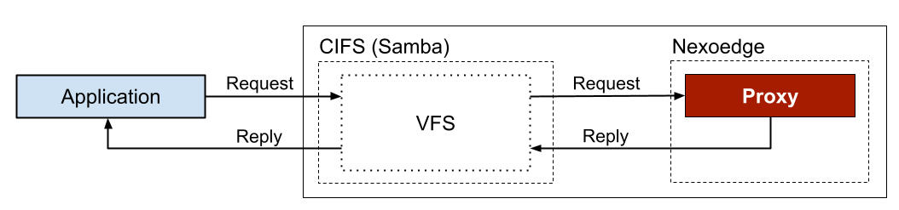

# Nexoedge

[](https://bestpractices.coreinfrastructure.org/projects/7760)

**Nexoedge is a multi-cloud storage system that employs erasure coding for data protection**. It applies a network-coding-inspired data repair technique on erasure coding for improved repair performance and supports major cloud storage providers as storage destinations. Nexoedge enables applications to seamlessly utilize storage services by major cloud storage providers as a unified reliable and storage-efficient storage pool.

## Overview

The system consists of two key entities: *proxy* and *agent*.

A proxy handles user requests and accesses data via remote agents. It transparently distributes (or reassembles) data to (or from) storage destinations via coding operations. It persists file metadata and system states to a metadata store.

An agent handles data access at storage destinations within the same data center or cloud. It also assists data repair by encoding data within the same data center or cloud and transferring it across clouds. Nexoedge abstracts each storage destination as a *storage container*. An agent can manage one or multiple storage containers, while each storage container is always associated with one agent.


Nexoedge provides file storage access to applications via the Server Message Block (SMB) storage protocol. Specifically, we extended the open-source [Samba][samba] framework by adding a virtual file system (VFS) module which communicates with an Nexoedge proxy for data storage.

In a general deployment, we assume each Nexoedge entity is hosted on a separate node (e.g., physical server or virtual machine). Agent nodes run in the cloud, whilst the proxy node runs at the edge (hosting both the proxy and the SMB server).

Nexoedge proxies and agents communicate over TCP/IP connections with optional [traffic encryption][zeromq-curve].

[zeromq-curve]: https://rfc.zeromq.org/spec/26/

### Modular Design

Nexoedge adopts a modular design to enable future system extension, e.g., addition of new features and customization.

Key modules in a proxy and their functions:

- Chunk Manager: Perform data transformation between file data and chunk data to achieve fault tolerance.
- I/O: Transfer chunk data between a proxy and an agent.
- Coordinator: Monitor agents' status.
- Metastore: Persist and manage file metadata and system states in the metadata store.

Key modules in an agent and their functions:

- Container Manager: Execute requests on chunk data at storage destinations.
- I/O: Handle requests and transfers of chunk data between a proxy and an agent.
- Coordinator: Notify a proxy coordinator of agent status changes and reply to requests from proxies.

### File Operations

Nexoedge supports the following basic file operations:

- File create (new write)
- File read
- File overwrite (full-file)
- File copying
- File repair (recover lost chunks)
- File deletion

### Storage Schemes

Nexoedge supports the following coding schemes for data redundancy:

- [Reed-Solomon (RS) codes][rscodes] 

Nexoedge realizes the [repair method][rscar] upon RS codes for reduced repair traffic across data centers and clouds.

### Storage Interface

Nexoedge exports a file-based interface using the [Server Message Block (SMB)][smb] protocol. 

#### SMB

Nexoedge exports an SMB interface by extending [Samba][samba]. 



The Samba server communicates with Nexoedge via TCP/IP sockets. 

See the [build and installation guide](INSTALL.md) for the installation instructions.

### System Monitoring Tools

#### Status Report

Reporter (`ncloud-reporter`) is a tool which communicates with a proxy to generate reports on system status (e.g., agents' status) and storage usage.

#### Admin Portal

Admin portal is a user-friendly web-based portal for monitoring the Nexoedge system. It visualizes the system status and operation statistics which a reporter periodically collects from a proxy.


The portal is available in the release section.

## Build and Installation

See the [build and installation guide](INSTALL.md) for details.

## Configuration

We provide the example configuration files in the directory `sample/` for running a standalone test.

See the [configuration guide](CONFIG.md) for details on the available configuration options.

## Running Nexoedge

### Setup

This example describes a setup with a Samba server, *one* proxy, and *five* agents. We assume the following

* A Redis instance runs on the same node with the proxy as the metadata store (see the [installation guide](INSTALL.md) for details).

* A Samba server runs on the same node as the proxy.

* Each node either runs a proxy or an agent.

#### Port Usage

Nexoedge listens on the following ports by default for entity communications.

* Proxy: 57002, 59001

* Agent: 57003-57004

The Samba server listens on port 445 by default.

### Procedure

1. Follow the [installation guide](INSTALL.md) to build Nexoedge.

1. On all node, copy all the sample configuration files from the directory `sample/` to the working directory, e.g., under the `build` folder.
   
   ```bash
   cp <nexoedge source root directory>/sample/*.ini .
   ```

1. On each agent node, update the following fields in the configuration file `agent.ini`
   
   - `agent` > `ip`: IP address or domain name of the respective agent node (reachable/resolvable by the proxy node)
   - `agent` > `num_containers`: number of containers, set it to `1` for 1 container over each of the four agents
   - `container01` > `id`: ID of the container, **must be UNIQUE among all containers of all agents**

1. On each agent node and the proxy node, update the following fields in the configuration file `general.ini`.
   
   - `proxy01` > `ip`: IP address or domain name of the proxy node

1. On the proxy node, run the proxy, e.g., under the `build` folder.
   
   ```bash
   ./bin/proxy
   ```

1. On each agent node, run an agent, e.g., under the `build` folder.
   
   ```bash
   ./bin/agent
   ```

1. On the proxy node, run the reporter to check the system status, e.g., under the `build` folder.
   
   ```bash
   ./bin/ncloud-reporter
   ```

1. Make the communication library visible on the system. (Note: the paths must be absolute.)
   
   ```bash
   sudo ln -s <nexoedge source root directory>/build/lib/libncloud_zmq.so /usr/local/lib/
   ```

1. On the proxy node, install the Samba service according to the [installation guide](INSTALL.md) and start the Samba server.
   
   ```bash
   sudo service ncloud-cifs start
   ```

1. Install a Samba client, e.g., `smbclient` on the proxy node.
   
   ```bash
   sudo apt install -y smbclient
   ```

1. Upload a file using the Samba client.
    
    ```bash
    smbclient -U <user> --password <password> //127.0.0.1/ncloud -c "put <path to file>"
    ```

1. Download a file using the Samba client.
    
    ```bash
    smbclient -U <user> --password <password> //127.0.0.1/ncloud -c "get <filename> <download filename>"
    ```

1. Stop the Samba server.
    
    ```bash
    sudo service ncloud-cifs stop
    ```

1. Terminate the proxy, by pressing "Ctrl+C", or sending a "SIGTERM" signal to it.

1. Terminate all agents, by pressing "Ctrl+C", or sending a "SIGTERM" signal to them.

## For Developers

### Source Code Documentation

Install Doxygen,

```bash
sudo apt install doxygen graphviz
```

Compile the documentation under the source code root directory,

```bash
doxygen
```

### Contribution Guidelines

See the [code contribution guidelines](CONTRIBUTING.md) for details.

### Component Testing

See the [testing guide](TESTING.md) for details.

## Open-source Libraries

See the [list of libraries](OPEN_SOURCE_LIBS.md) for details.

## Project Licenses

The project source code is released under the [Apache License, version 2.0](https://www.apache.org/licenses/LICENSE-2.0) (see also the [license file](LICENSE)).

The project documentation is released under the [Creative Commons Attribution 4.0 International License](https://creativecommons.org/licenses/by/4.0/).

## Maintainers/Contributors

See [the list of maintainers](MAINTAINER.md).


[smb]: https://www.samba.org/cifs/docs/what-is-smb.html

[samba]: http://www.samba.org/

[rscodes]: https://en.wikipedia.org/wiki/Reed%E2%80%93Solomon_error_correction

[rscar]: https://doi.org/10.1109/DSN.2016.37
