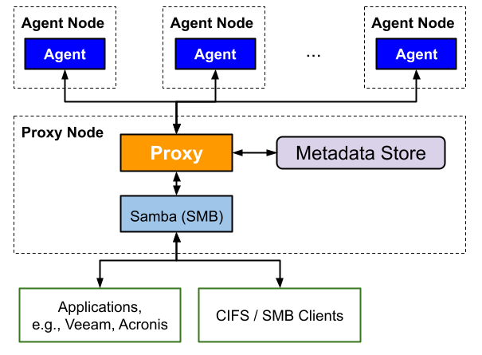
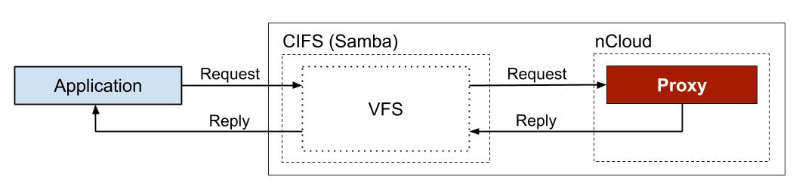
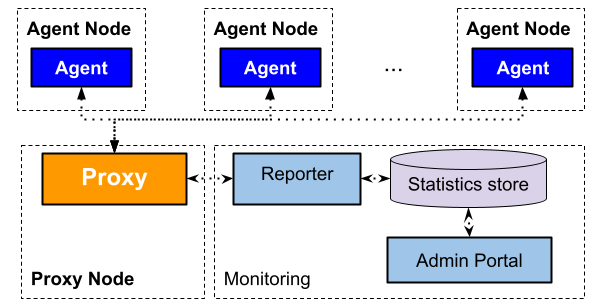

# nCloud

*Community Version (v1.0)* 

**nCloud is a multi-cloud storage system that employs erasure coding for data protection**. It applies a network-coding-inspired repair technique on erasure coding for improved repair performance and supports multiple cloud storage as storage destinations. By interconnecting multiple cloud storage, nCloud enables applications to seamlessly utilize multiple cloud storage as a reliable and storage-efficient storage. 

## Overview

The system consists of two key entities: *proxy* and *agent*.

A proxy handles user requests and access data in storage destinations via remote Agents.  It transparently distributes/reassembles data in storage destinations via coding operations. It persists file metadata and system states to a metadata store.

An agent handles data access at storage destinations within the same data center or cloud, and assists data repair by encoding data within the same data center or cloud. nCloud abstracts each storage destination as a *storage container*. An agent can manages multiple storage containers, while each storage container is associated with one agent.



nCloud provides file storage to applications using the SMB storage protocol. Specifically, we extended the open-source [Samba][samba] framework by adding a virtual file system (VFS) module which communicates with an nCloud proxy for data storage.

nCloud proxies and agents communicates over TCP/IP connections.

### Modular Design

nCloud adopts a modular design to enable further system expansion, e.g., addition of new features and customization.

Modules in a proxy and their functions:

- Chunk Manager: Perform data transformation between file data and chunk data to support fault tolerated data storage.
- IO: Transfer chunk data between a proxy and an agent
- Coordinator: Monitor agents' status.
- Metastore: Persist and manage file metadata and system states in the metadata store.

Modules in an agent and their functions:

- Container Manager: Execute requests on chunk data in storage destinations.
- IO: Handle requests and transfers of chunk data between a proxy and an agent
- Coordinator: Notify a proxy coordinator of its status changes and reply to requests

### File Operations

nCloud supports the following basic file operations:

- File create (new write)
- File read
- File overwrite (full-file)
- File copying
- File repair (recover lost chunks)
- File deletion

### Storage Schemes

nCloud supports the following coding schemes for data redundancy:

- [Reed-Solomon (RS) codes][rscodes] 

nCloud realizes the [repair method][rscar] for RS codes for reduced repair traffic in a multi-cloud storage.

### Storage Interface

nCloud exports a file-based interface using the [SMB][smb] protocol. 

#### SMB

nCloud exports a SMB interface by extending VFS of [Samba][samba]. 



The SMB interface communicates with nCloud via sockets. 

See the [build and installation guide](INSTALL.md) for the installation instructions.

### System Monitoring Tools

#### Status Report

Reporter (`ncloud-reporter`) is a tool which communicates with a proxy to generate reports on agents' status and storage usage.

#### Admin Portal

Admin portal is a user-friendly web-based portal for monitoring the nCloud system. It visualizes the status and statistics which a reporter periodically collects from a proxy.



The portal is available in the release section.

## Build and Installation

See the [build and installation guide](INSTALL.md) for details.

## Configuration

We provide example configuration files in the directory `sample/` for running standalone test.

See the [configuration guide](CONFIG.md) for details on the available configuration options.

## Running nCloud

### Setup

This example describes a setup with a Samba service, *one* proxy, and *five* agents. We assume the following

* A Redis instance run on the same machine with the proxy as the metadata store (see the [installation guide](INSTALL.md) for details).

* Samba service run on the same machine as the proxy.

* Each machine either run a proxy or an agent.

#### Port Usage

nCloud listens on the following ports by default for entity communications.

* Proxy: 57002, 59001

* Agent: 57003-57004

Samba listens on port 445 by default.

### Procedure

1. On all machines, copy all the sample configuration files from the directory `sample/` to the working directory, e.g., the `build` folder.
   
   ```bash
   cp <ncloud source root directory>/sample/*.ini .
   ```

2. On each of the agent machines, update the following fields in the configuration file `agent.ini`
   
   - `agent` > `ip`: IP address or domain name of the respective agent machine (reachable/resolvable by the proxy machine)
   - `agent` > `num_containers`: number of containers, set it to `1` for 1 container over each of the four agents
   - `container01` > `id`: ID of the container, **must be UNIQUE among all containers of all agents**

3. On each of the agent machines and the proxy machine, update the following fields in the configuration file `general.ini`.
   
   - `proxy01` > `ip`: IP address or domain name of the proxy machine

4. On the proxy machine, run the proxy, e.g., under the `build` folder.
   
   ```bash
   ./bin/proxy
   ```

5. On each agent machine, run an agent, e.g., under the `build` folder.
   
   ```bash
   ./bin/agent
   ```

6. On the proxy machine, run the reporter to check the system status, e.g., under the `build` folders.
   
   ```bash
   ./bin/ncloud-reporter
   ```

7. Make the communication library visible on the system. (Note: the paths must be absolute.)
   
   ```bash
   sudo ln -s <ncloud source root directory>/build/lib/libncloud_zmq.so /usr/local/lib/
   ```

8. On the proxy machine, install the Samba service according to the [installation guide](INSTALL.md) and start the Samba server.
   
   ```bash
   sudo service ncloud-cifs start
   ```

9. Install a Samba client, e.g., `smbclient` on the proxy machine.
   
   ```bash
   sudo apt install -y smbclient
   ```

10. Upload a file using the Samba client.
    
    ```bash
    smbclient -U <user> --password <password> //127.0.0.1/ncloud -c "put <path to file>"
    ```

11. Download a file using the Samba client.
    
    ```bash
    smbclient -U <user> --password <password> //127.0.0.1/ncloud -c "get <filename> <download filename>"
    ```

12. Stop the Samba server.
    
    ```bash
    sudo service ncloud-cifs stop
    ```

13. Terminate the proxy, by pressing "Ctrl+C", or sending a "SIGTERM" signal to it.

14. Terminate all agents, by pressing "Ctrl+C", or sending a "SIGTERM" signal to them.

## For Developers

### Source Code Documentation

Install Doxygen,

```bash
sudo apt install doxygen graphviz
```

Compile the documentation under the source code root directory,

```bash
doxygen
```

### Contribution Guidelines

See the [code contribution guidelines](CONTRIBUTING.md) for details.

### Component Testing

See the [testing guide](TESTING.md) for details.

## Open-source Libraries

See the [list of libraries](OPEN_SOURCE_LIBS.md) for details.

## Open-source License

See the [license file](LICENSE) for details.

## Contributors (in alphabetical order)

- [Chan, Hoi Wan (Helen)][helen_chan]
- [Cheng, Keyun][keyun_cheng]
- [Ge, Jianhui (Jerome)][jianhui_ge]
- [Liu, Ho Man (James)][james_liu]
- [Liu, Zhuofei][zhuofei_liu]
- [Qin, Hailin (Jessica)][jessica_qin]
- Wong, Tsz Fung (Ivan)
- [Zhang, Mi][mzhang]

[smb]: https://www.samba.org/cifs/docs/what-is-smb.html

[samba]: http://www.samba.org/

[rscodes]: https://en.wikipedia.org/wiki/Reed%E2%80%93Solomon_error_correction

[rscar]: https://doi.org/10.1109/DSN.2016.37

[helen_chan]: https://helenchw.github.io

[james_liu]: https://github.com/hmliu6

[zhuofei_liu]: https://github.com/francisforeverhappy 

[jessica_qin]: https://github.com/HailinQinJessica

[keyun_cheng]: https://keyuncheng.github.io

[mzhang]: https://millyz.github.io

[jianhui_ge]: https://github.com/JeromeGJH
