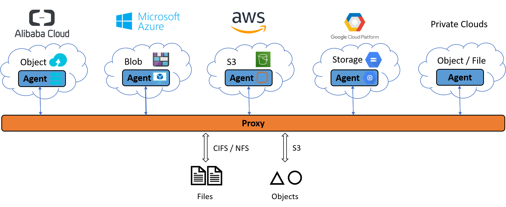
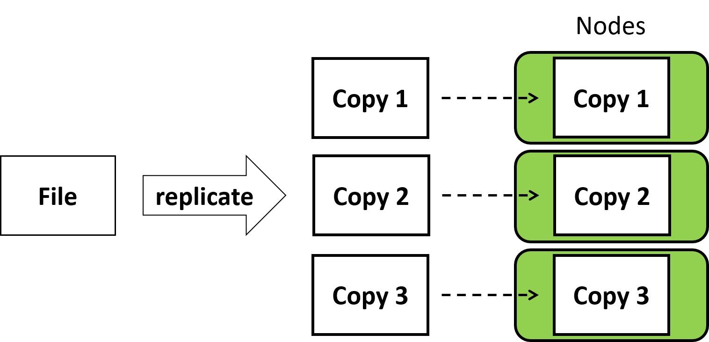
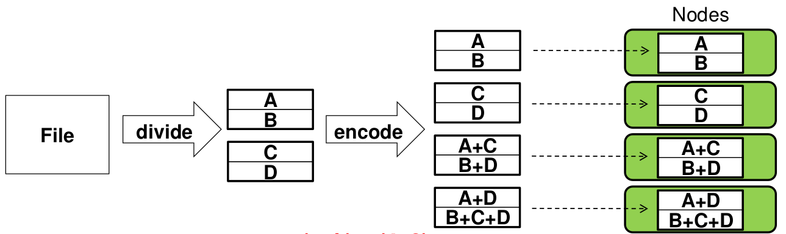
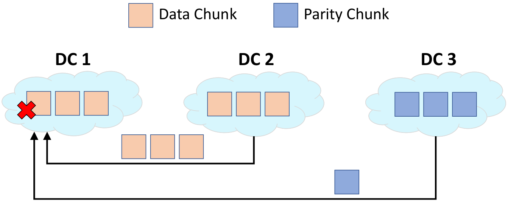
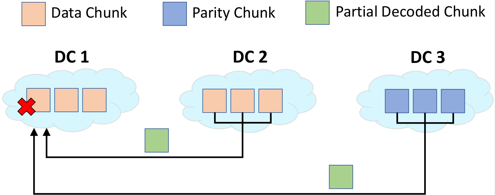
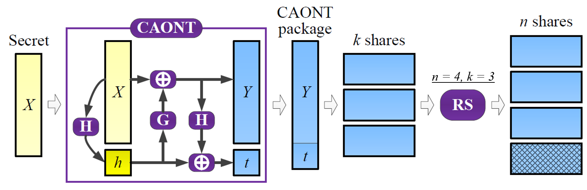
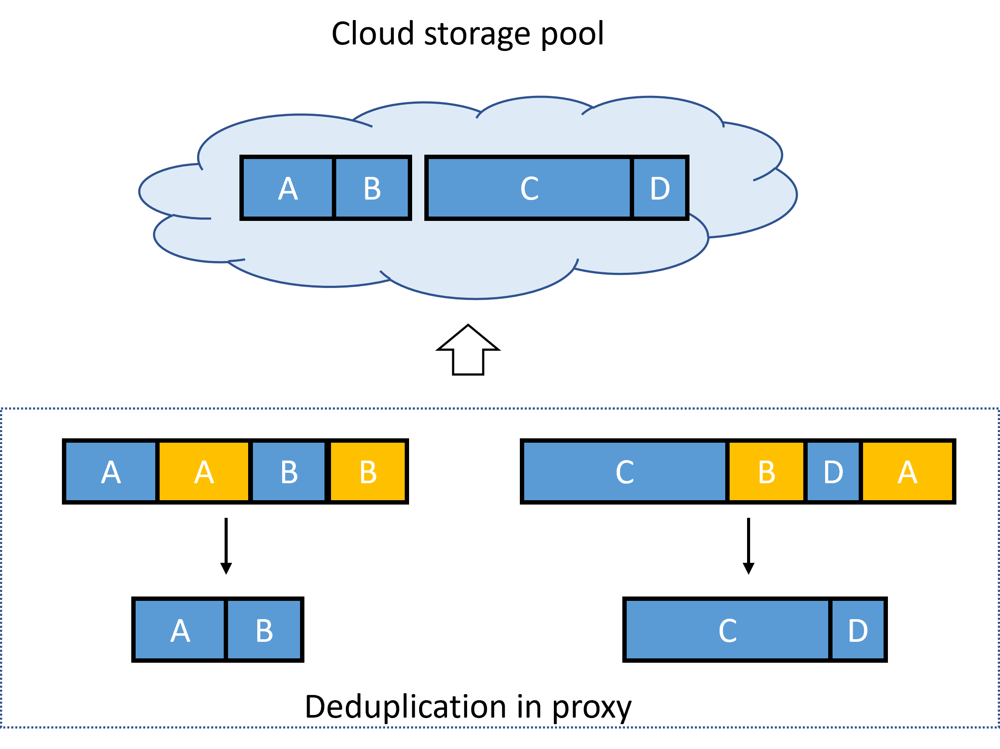

Overview
========

**nCloud** is a multi-cloud storage system that builds on the network coding technology to provide reliability, security, low-cost, scalability, performance, and configurability guarantees. nCloud enables applications to seamlessly utilize cloud storage in multiple clouds as a reliable and efficient storage pool.

Key Entities
------------

nCloud consists of two key entities: *proxy* and *agent*.

A proxy handles user requests and access data in storage destinations via remote agents. It distributes/reassembles data in storage destinations via coding operations for fault tolerance and security. It persists file metadata and system states to a metadata store.

An agent handles data access at storage destinations within the same data center or cloud, and assists data repair by encoding data among the storage destinations. nCloud abstracts each storage destination as a *storage container*. An agent can manage multiple storage containers, while each storage container is associated with one agent.

:numref:`ncloud-arch` shows the architecture of nCloud.

   nCloud Architecture

Users and applications can access data in nCloud through the standard file storage protocol SMB (or CIFS) in the community version. In the enterprise version, nCloud also supports data access via NFS and the object storage protocol S3.

Data Protection
---------------

Fault Tolerance
+++++++++++++++

nCloud supports storage schemes based on erasure coding for fault tolerance in the community version. In the enterprise version, it also supports erasure coding schemes with enhanced security and network coding.

Data fault tolerance level in nCloud are configurable via three parameters:

* *k*, the number of data chunks
* *n*, the total number of chunks, including data and parity, where *n* > *k*
* *f*, the number of agent failures to tolerate

When nCloud stores each chunk in an independent storage container, data in nCloud remains available even when up to *n-k* chunks fail. 

Replication
^^^^^^^^^^^

Replication is the traditional method for fault tolerance, where *n* replicas of data are stored to tolerate at most *n-1* replica failures (a.k.a. *n*-way replication). The storage overhead is hence *n*-times of the original data. :numref:`replication` shows an example of 3-way replication, in which 3 identical copies of data are stored on 3 storage nodes to tolerate at most 2 failures.

   3-way replication

Erasure Coding
^^^^^^^^^^^^^^

The main idea of erasure coding is to divide data into *k* chunks and encode them into *n* chunks with redundancy added, such that the original data is always recoverable by decoding a set of any *k* of *n* chunks [#]_. These *n* chunks are always distributed to storage nodes that fail independently. Hence, erasure codes incurs a storage overhead of *n*/*k*-times of the original data. The lower storage overhead of erasure coding over replication is a major advantage, which translates to lower storage footprint and hence cost saving. To repair a failed chunk, a repair node reads *k* chunks (i.e., the repair traffic equals to the file size) from alive nodes and encodes them to recover the failed chunk.

:numref:`ec` illustrates how erasure coding works on data when *n* = 4 and *k* = 2. In this example, the file is first divided into 2 chunks, with content {A,B} and {C,D}, respectively. Then, they are encoded into 4 chunks and distributed to 4 storage nodes. The storage overhead here is 2-times. When compared to 3-way replication, the storage overhead is 33% lower.

   Example of erasure coding when *n* = 4 and *k* = 2

nCloud supports Reed-Solomon (RS) codes of erasure coding, with a minimum value of *n* and *k* as 3 and 2, respectively.

.. [#] Note that we consider erasure codes that are *maximum distance separable (MDS)*. For non-MDS codes, recoverability of the original data is not always guaranteed with only *k* chunks available. nCloud adopts erasure codes that are MDS.

Recovery Optimization
+++++++++++++++++++++

Erasure Coding
^^^^^^^^^^^^^^

To optimize recovery under erasure coding, nCloud implements the repair optimization technique *CAR* [#]_ for erasure coding. We illustrate the repair flow of conventional erasure coding in :numref:`ec-repair` and how CAR reduces repair bandwidth using an example of 3 data centers (DCs) with *n* = 9 and *k* = 6 in :numref:`nc-repair`.

   Conventional repair without CAR under single-chunk failure 

Under conventional repair in erasure coding, DC 1 needs to collect 4 chucks from DC 2 and DC 3, and 2 chunks locally for recovering the failed chunk. Since cross-data-center network bandwidth (e.g., 1Gbps) is significantly lower than intra-data-center bandwidth (e.g., 10Gbps) in general due to operational cost, having a large repair traffic across data centers can become a performance bottleneck in data recovery. 

   Repair using CAR under single-chunk failure

To save the cross-data-center repair traffic, CAR partially encodes chunks in DC 2 and DC 3 before sending one partial coded chunk from each of DC 2 and DC 3 to DC 1 for repair. This reduces the cross-data-center center bandwidth usage over the conventional approach (by 50% in this example), and hence speeds up recovery with less impact on normal operations (e.g., writes and reads).

.. [#] `Zhirong Shen, Jiwu Shu and Patrick P. C. Lee, "Reconsidering Single Failure Recovery in Clustered File Systems," 2016 46th Annual IEEE/IFIP International Conference on Dependable Systems and Networks (DSN). <https://ieeexplore.ieee.org/document/7579752>`_

Data Integrity
++++++++++++++

nCloud protects data integrity using file-/object-level and chunk-level checksums. Checksum verification can be enabled for data access operations.

Automated Recovery
++++++++++++++++++

nCloud supports automated recovery to restore data fault tolerance level and correct corrupted data. Periodic scans and repairs are configurable to run separately at regular intervals, e.g., every 4 hours.

nCloud adopts the "security-via-diversity" approach, in which security is achieved by leveraging the diversity of storage, e.g., vendors, software, and hardware.

Security via Diversity
++++++++++++++++++++++
(Enterprise version only)

nCloud realizes secure sharing (CAONT-RS [#]_) for data security. CAONT transforms data such that data remains secure even if a party obtains part of the transformed data. In the meantime, data integrity is verifiable during decoding. :numref:`caontrs` shows the workflow of CAONT-RS when *n* = 4 and *k* = 3. 

   Workflow of CAONT-RS, with *n* = 4 and *k* = 3 for RS

nCloud treats the original data as the *secret* (*X*) in the algorithm and distributes the resulting *package* using erasure coding. CAONT first computes a hash (*h*) of the original data. It then masked the original data using a *mask block* (*G*) generated with the hash to give the *transformed data* (*Y*). It further computes another hash from the masked data for masking the hash of the original data, resulting in a *masked hash* (*t*). It finally appends the masked hash to the transformed data to form a CAONT package. After that, nCloud applies RS codes to the package by dividing it into *k* shares and generating *n* shares with redundancy added. Finally, nCloud distributes the *n* shares to *n* independent storage containers for fault tolerance. To decode the original data, a user needs to retrieve at least *k* out of *n* shares. Hence, when an adversary cannot reveal any data with fewer than *k* (compromised) shares.

.. [#] `Mingqiang Li, Chuan Qin, and Patrick P. C. Lee. 2015. CDStore: toward reliable, secure, and cost-efficient cloud storage via convergent dispersal. In Proceedings of the 2015 USENIX Conference on Usenix Annual Technical Conference (USENIX ATC '15). <https://dl.acm.org/doi/10.5555/2813767.2813776>`_

Storage Saving
--------------

Deduplication
+++++++++++++
(Enterprise version only)

nCloud supports inline variable-sized data deduplication for storage saving and improved write performance. :numref:`variable-sized deduplication` illustrates how variable-sized deduplication applies during data write at the proxy, with unique data in blue and duplicated data in yellow. First, the proxy subdivides data into variable-sized blocks according to configurable parameters. Then, the proxy identifies and skips the duplicate data when transferring data to the cloud. By sending and storing only unique data in the cloud, nCloud increases the logical usable storage capacity under a given physical storage capacity of clouds, which translates to cost reduction in both network and storage in multi-cloud scenarios. 

   Variable-sized deduplication for Data Write

Optimizations
-------------

Performance
+++++++++++

Multi-threading and Pipelining
^^^^^^^^^^^^^^^^^^^^^^^^^^^^^^
(Enterprise version only)

nCloud employs a multi-threaded design for concurrent request processing and data access. Furthermore, nCloud pipelines coding and storage access operations for high performance. The designs enable a better utilization of computing power and network bandwidth in multi-core and high-bandwidth servers via parallelism.

Staging
^^^^^^^

nCloud also comes with a *staging* option to speed up writes and reads. Staging works similarly to a write-back cache, which persistently buffers data in a *staging storage area* (e.g., local file system of the proxy) when handling requests before writing the data back to cloud in background. When staging is enabled, nCloud acknowledges writes immediately after it stores the request data to the staging storage area. This is particularly useful in reducing write latency for deployments with limited-bandwidth or high-latency network connections to cloud, saving the clients from waiting for high-latency synchronous write to cloud. In addition, the staging storage area also caches recent data read from cloud for high-performance read. The background write-back timing is policy-based and configurable.

Storage Access
--------------

In the community version, nCloud supports the standard network file system protocol SMB (or CIFS). In the enterprise version, it supports also NFS and object storage protocol S3. 

For file operations, create, read, overwrite, rename, copy, and delete, are supported. For object operations, put, get, copy, deletion, and multi-part upload are supported.

