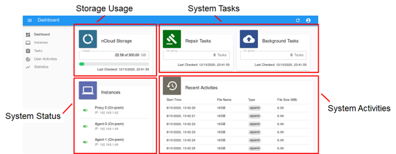

System Monitoring
=================

nCloud provides a web-based admin portal and a CLI tool for system monitoring.

Admin Portal
++++++++++++

We provide a user-friendly web-based admin portal for administrators to monitor the nCloud system status. It visualizes the status and statistics.

   nCloud Admin Portal

The installation and usage guide of the admin portal is available in a separate documentation.

CLI Tools
+++++++++

nCloud reporter (`ncloud-reporter`) communicates with a proxy to generate reports on agents' status and storage usage.

To check nCloud's status, on a machine which runs a proxy or an agent:

.. code-block:: bash

   $ ncloud-reporter /usr/lib/ncloud/current

An example output of reporter is shown as follows.

.. code-block::

   Time: MMM DD HH:MM:SS YYYY 
   ================================================================================
   > Proxy [On-prem] CPU (2, 3.000000, 4.040404) Mem (used/total) 7652MB/7977MB Net RX 0.00B/s TX 0.00B/s
   > Proxy is connected to 2 Agents
       1. Agent [ALIVE] at 192.168.1.64 (On-prem) with  2 containers
          CPU (2, 0.000000, 0.000000) Memory 1683MB/3945MB Net TX 0.00B/RX 0.00B
         Container [  1] [On-prem],             0/ 161061273600 (     0B/150.00GB), 0.00% used
         Container [  2] [On-prem],             0/ 161061273600 (     0B/150.00GB), 0.00% used
       2. Agent [ALIVE] at 192.168.1.66 (On-prem) with  2 containers
          CPU (2, 0.000000, 0.000000) Memory 1836MB/3945MB Net TX 485.77B/RX 645.70B
         Container [  3] [On-prem],             0/ 161061273600 (     0B/150.00GB), 0.00% used
         Container [  4] [On-prem],             0/ 161061273600 (     0B/150.00GB), 0.00% used
   > Number of on-going background tasks: 0
   > No files pending for repair
   > Storage usage =             0/ 322122547200 (     0B/300.00GB, 100.00% free)
   ================================================================================

The output contains the following information.

- Contacted Proxy

  #. Machine type
  #. Number of CPUs
  #. CPU utilization
  #. Memory usage
  #. Network traffic (transmit and receive)
  #. Number of on-going background tasks
  #. List of connected agents 

- Each connected agent

  #. Status
  #. IPv4 address
  #. Machine type
  #. Number of containers
  #. Number of CPU
  #. CPU utilization
  #. Memory usage
  #. Network traffic (transmit and receive)

- Each storage container of connected agents

  #. ID
  #. Storage type
  #. Storage usage

- Other system status

  #. Number of files pending to repair
  #. Usable storage capacity and usage
