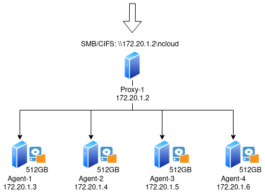

Quick Setup Guide
=================

Architecture
++++++++++++

We assume the following setup in this guide, as shown in :numref:`arch`.

All machines run Ubuntu 22.04 LTS (64-bit) server.

- 1 machine for client

  - Machine is in the same network segment with other machines.

- 1 machine for a proxy instance

  - Coding parameter is (*n* =4, *k* =2).
  - Chunk size is 8MiB.
  - The machine's IP address is 172.20.1.2.
  - The machine also runs a local Redis instance as the metadata store.

- 4 machines for 4 agents

  - Each agent has one data container of 512GB.
  - The machines' IP addresses are 172.20.1.{3,4,5,6}.

- Storage protocol: SMB/CIFS

  - File share name is "ncloud".
  - URI is \\\\172.20.1.2\\ncloud.

   System architecture with 1 proxy and 4 agents

Physical and Virtual Machines
+++++++++++++++++++++++++++++

#. Download the Debian packages:

   - For the proxy machine, download ncloud-|version|-amd64-proxy.deb.
   - For the agent machine, download ncloud-|version|-amd64-agent.deb.

#. Update the APT repository list: 

   .. code-block:: bash

      $ sudo apt update

#. On the proxy machine,

   - Start Redis

     .. code-block:: bash

        $ sudo service redis start

   - Install the nCloud proxy

     .. code-block:: bash

        $ sudo dpkg -i ncloud-<version>-amd64-proxy.deb; sudo apt install -f -y

     - Type **'yes'** to start the systemd-managed service for the proxy
   
   - Configure the proxy 

     - In ``/usr/lib/ncloud/current/proxy.ini``, update 

       - Under ``[coding]``, ``n = 4``
       - Under ``[coding]``, ``k = 2``
       - Under ``[misc]``, ``max_chunk_size = 8388608`` 

   - Check the proxy status

     .. code-block:: bash

        $ systemctl status ncloud-proxy

#. On each agent machine,

   - Install the nCloud agent

     .. code-block:: bash

        $ sudo dpkg -i ncloud-<version>-amd64-agent.deb; sudo apt install -f -y

     - Type **'yes'** to start the systemd-managed service for the agent
   
   - Configure the agent

     - In ``/usr/lib/ncloud/current/agent.ini``, update 

       - Under ``[agent]``, ``ip = 172.20.1.<last digit of IP>``
       - Under ``[agent]``, ``num_containers = 1``
       - Under ``[container01]``, ``id = <last digit of IP>``
       - Under ``[container01]``, ``capacity = 549755813888``

     - In ``/usr/lib/ncloud/current/general.ini``, update 

       - Under ``[proxy01]``, ``ip = 172.20.1.2``

   - Restart the agent

     .. code-block:: bash

        $ sudo service ncloud-agent restart

   - Check the agent status 

     .. code-block:: bash

        $ systemctl status ncloud-agent

#. On the proxy machine, check the nCloud status:

   .. code-block:: bash

      $ ncloud-reporter /usr/lib/ncloud/current

   The reporter should show the proxy is connected to four agents with one container of 512GB each.

#. On the proxy machine, install and start the Samba SMB service.

   - Download the SMB package (`ncloud-cifs.tar.gz`) and unpack it

     .. code-block:: bash

        $ tar zxf ncloud-cifs.tar.gz

   - Move the folder `samba/` under `/usr/local/`

     .. code-block:: bash

        $ sudo mv samba /usr/local/

   - Create the SMB share folder

     .. code-block:: bash

        $ sudo mkdir -p /smb/ncloud && sudo chmod 777 /smb/ncloud

   - Run `install.sh` under the folder `scripts`

     .. code-block:: bash

        $ cd scripts && sudo bash install.sh

   - Start the SMB service

     .. code-block:: bash

        $ sudo service ncloud-cifs start

   - Add a Samba user, e.g., `ncloud`, with password, e.g., `ncloud`. Note the user must already exist in the system.

     .. code-block:: bash

        $ sudo /usr/local/samba/bin/pdbedit -a ncloud
  
     Enter the password twice

#. On the client machine, install a SMB client (e.g., ``smbclient``) and try uploading and downloading files. 
  
   - Install a Samba client, e.g., `smbclient`

     .. code-block:: bash

        $ sudo apt install -y smbclient

   - Upload a file using the Samba client.

     .. code-block:: bash

        $ smbclient -U <user> --password <password> //172.20.1.2/ncloud -c "put <path to file>"

   - Download a file using the Samba client.
    

     .. code-block:: bash

        $ smbclient -U <user> --password <password> //172.20.1.2/ncloud -c "get <filename> <download filename>"
